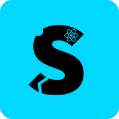

<p align="center">
  
</p>

# Srotas 🔁


**Srotas** (स्रोतस्) is a lightweight React-friendly utility library offering a set of reusable event handler functions. It helps developers avoid boilerplate code by offering common event handling patterns — debouncing, throttling, blocking key presses, preventing right clicks, and more.

The name *Srotas* — derived from Sanskrit — means “stream” or “flow”, a poetic nod to the flow of events this library elegantly manages.

---

## Features 🌊

- 🎯 **Focused API**: Tiny, purposeful, and highly reusable event utilities.
- 💡 **Typed Handlers**: Built with full TypeScript support and IDE autocompletion.
- ⚛️ **React-Ready**: Designed for seamless integration in React apps.
- ⚡ **Zero Dependencies**: Tree-shakable and dependency-free.
- 🧪 **Dev-First**: Built with Vite, TypeScript, and tested for production use.

---

## Installation 📦

```bash
npm install srotas
# or
yarn add srotas
# or
pnpm add srotas
```

### Prerequisites

Ensure you have the following installed:

- **Node.js**: v22 or later.
- **React**: v19 or later.

---

## Usage ⚙️

```ts
import {
  preventDefaultOnly,
  stopPropagationOnly,
  preventAndStopEvent,
  debounceEvent,
  throttleEvent,
} from "srotas";

<button onClick={preventAndStopEvent}>Click</button>
```

You can also use more advanced handlers like:

```ts
<input
  onKeyDown={(e) => blockKeyPress(e, ["Enter", "Escape"])}
  onChange={debounceEvent((e) => handleInputChange(e), 300)}
/>
```

---

## Exports 📤

### General Handlers

```ts
preventDefaultOnly(e)
stopPropagationOnly(e)
preventAndStopEvent(e)
```

### Debug Handlers

```ts
logEventDetails(e)
```

### Context-Specific Handlers

```ts
preventRightClick(e)
focusElement("#input-id")
preventDrag(e)
blockKeyPress(e, ["Enter", "Escape"])
```

### Utility Handlers

```ts
debounceEvent(handlerFn, delay)
throttleEvent(handlerFn, limit)
```

All handlers are strongly typed and compatible with React's synthetic events.

---

## Project Structure 📂

```bash
srotas/
├── src/               # Source files
│   ├── handlers/      # All utility/event handler functions
│   └── index.ts       # Entry point for all exports
├── tests/             # Unit tests
├── dist/              # Bundled output (auto-generated)
├── vite.config.ts     # Vite configuration
├── tsconfig.json      # TypeScript config
├── package.json       # Package metadata
├── LICENSE.md         # MIT License
└── README.md          # Project documentation
```

---

## Scripts 🚀

```bash
# Build the package
npm run build

# Testing code
npm run test

# Formatting code
npm run format

# Lint for errors
npm run lint
```

---

## License 📜

This project is licensed under the MIT License. See the [LICENSE](LICENSE.md) file for details.

---

## Acknowledgments 🙌

- Inspired by repetitive patterns seen across frontend projects — especially in form handling, keyboard interactivity, and user inputs.
- The name *Srotas* reflects the idea of controlling streams and flows — whether of data, events, or user interaction.
- Built with 🧡 by [Tejas](https://github.com/your-username) and open to contributions.
